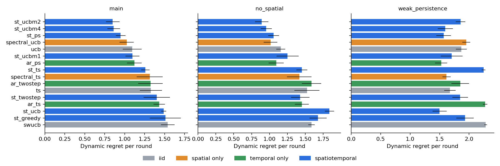

# Spatiotemporal Benchmark: Report

9 October 2026. Fluctuation-channel policies on a toy with 100 arms on a 10 × 10 grid, AR(20) fluctuations (coefficients summing to 0.97) and spatially correlated innovations, against iid, spatial-only and temporal-only bandits. The world, the policy families and the algorithm catalog are in [design.md](design.md). Code is in [code/](code) (`toy.py` runs, `analyze.py` summarizes), outputs in [results/](results).

## Results

Dynamic regret per round at T = 2,000, 8 seeds; full tables with standard errors are in [results/summary.md](results/summary.md). "Gap closed" is (regret of TS − regret of the policy) / (regret of TS − innovation lower bound).



| Policy | Uses | Main | No spatial correlation | Weak persistence |
| --- | --- | ---: | ---: | ---: |
| ST UCB, bonus 2 sd | spatiotemporal | **0.850** (46% closed) | **0.890** | 1.856 |
| ST UCB, bonus 4 sd | spatiotemporal | 0.863 | 0.953 | 1.596 |
| **ST predictive sampling** (no tuning) | spatiotemporal | **0.950** (37% closed) | 1.057 | 1.568 |
| SpectralUCB | spatial only | 1.026 | 1.014 | 1.953 |
| UCB1 | iid | 1.095 | 1.157 | 1.867 |
| AR predictive sampling | temporal only | 1.121 | 1.094 | **1.525** |
| ST Thompson sampling (current state) | spatiotemporal | 1.258 | 1.452 | 2.246 |
| Thompson sampling | iid | 1.329 | 1.523 | 1.675 |
| ST two-period score | spatiotemporal | 1.402 | 1.429 | 1.848 |
| ST UCB, theory constant (about 6.7 sd) | spatiotemporal | 1.489 | 1.838 | 1.499 |
| ST greedy | spatiotemporal | 1.509 | 1.678 | 1.932 |
| Sliding-window UCB | iid | 1.540 | 1.586 | 2.282 |
| *Innovation lower bound* | | *0.298* | *0.323* | *1.276* |

**Reading.**

1. **The spatiotemporal model wins once exploration targets the right uncertainty.** Predictive sampling explores only uncertainty that persists into the next round, and needs no tuning. It cuts dynamic regret 27% against TS and 13% against UCB1, closing 37% of the gap to the innovation lower bound. Tuned spatiotemporal UCB closes 46%.
2. **Exploring the wrong uncertainty is as harmful as ignoring the model:**
    - Greedy never explores, and is worse than TS.
    - Current-state TS samples the fresh innovation, and gains only 7%.
    - UCB with the theory constant explores about 6.7 sd and over-explores (−16%).

   This matches KuaiRec daily, where current-state TS was also the worst learning policy.
3. **Spatial correlation adds on top of persistence.** In the main configuration, joint predictive sampling beats the temporal-only version (0.950 against 1.121, 15%). Without spatial correlation, SpectralUCB is competitive, as expected.
4. **With weak persistence, the benefit shrinks.** The lower bound is already 1.28 per round, and the best policies close only 25–35% of the gap.
5. **Caveat.** The tuned UCB multipliers {1, 2, 4} were compared on the same runs, so the 2-sd result has mild selection bias. Predictive sampling has no tuning parameter and is the fair headline.

## Reproduce

From the repository root. The main run writes `runs.csv`; `--extra` adds the follow-up policies (tuned UCB, predictive sampling) to `runs_extra.csv`.

```sh
OPENBLAS_NUM_THREADS=1 .venv/bin/python -I experiments/simulations/spatiotemporal_benchmark/code/toy.py --verify
OPENBLAS_NUM_THREADS=1 .venv/bin/python -I experiments/simulations/spatiotemporal_benchmark/code/toy.py --seeds 8 --horizon 2000 --jobs 3
OPENBLAS_NUM_THREADS=1 .venv/bin/python -I experiments/simulations/spatiotemporal_benchmark/code/toy.py --seeds 8 --horizon 2000 --jobs 3 --extra
.venv/bin/python -I experiments/simulations/spatiotemporal_benchmark/code/analyze.py
```
