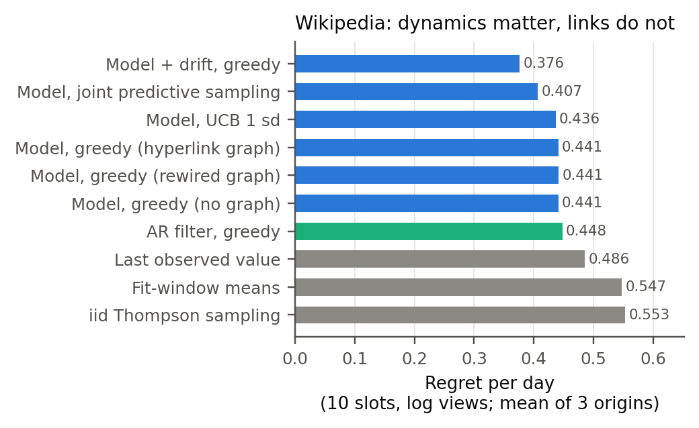

# Wikipedia Attention: Report

9 October 2026. Two panels of daily Wikipedia attention, where each article is an arm and hyperlinks are the graph. The design and the reason for the second panel are in [design.md](design.md).

| Panel | Arms | Graph result | Best policy against iid TS |
| --- | --- | --- | --- |
| [One domain](#panel-1-one-domain) | 150 programming-language articles | Null: hyperlinks add nothing beyond a domain-wide common shock | −32% (filter with drifting level) |
| [Six communities](#panel-2-six-communities) | 6 × 25 articles (NFL, NBA, MLB, Premier League, UN members, programming languages) | Hyperlinks carry community shocks and fit them best, but change decisions by only ±3% | −24% (spatiotemporal UCB, 1 sd) |

| Directory | Contents |
| --- | --- |
| [code/](code) | `collect.py` and `collect_multi.py` download the panels; `attention.py` runs diagnostics and policies |
| [data/](data) | `one_domain/` and `six_domains/`: views, hyperlinks, metadata |
| [results/](results) | `one_domain/` and `six_domains/`: `runs.csv` (regret per policy, origin and seed) and `diagnostics.json` |

## Panel 1: one domain

### What the data looks like

- **Persistence with a weekly cycle.** Lag-1 autocorrelation is 0.72, lag-7 is 0.74 and lag-30 is 0.37. The fitted AR coefficients are 0.46 (lag 1), −0.05 (lag 2) and 0.47 (lag 7); the spectral radius is 0.97.
- **Shocks are strongly correlated, through a common factor.** Innovations of all article pairs correlate at 0.218. Hyperlinked pairs correlate at 0.256 and rewired pairs at 0.250. Attention to the whole domain moves together (weekly and seasonal traffic, platform-wide effects), and hyperlinks add almost nothing beyond that and beyond degree.
- **Levels dominate fluctuations in scale.** The spread of long-run levels across articles is 1.05 on the log scale, against 0.41 for deviations.

### Results

Regret per day; 5 seeds for stochastic policies ([runs.csv](results/one_domain/runs.csv), [diagnostics.json](results/one_domain/diagnostics.json)).

| Policy | F = 365 | F = 730 | F = 1,095 | Mean |
| --- | ---: | ---: | ---: | ---: |
| Spatiotemporal filter with drifting level, greedy | 0.045 | 0.828 | 0.254 | **0.376** |
| Joint predictive sampling | 0.085 | 0.848 | 0.287 | 0.407 |
| Spatiotemporal UCB, 1 sd | 0.054 | 0.999 | 0.256 | 0.436 |
| Sparse history: UCB 1 sd / greedy | | | | 0.438 / 0.438 |
| Spatiotemporal greedy, hyperlink / rewired / no graph | 0.050 | 1.015 | 0.258 | 0.441 / 0.441 / 0.441 |
| AR filter (temporal only), greedy | 0.053 | 1.028 | 0.262 | 0.448 |
| Sparse history: iid TS / joint predictive sampling | | | | 0.472 / 0.475 |
| Last observed value | 0.045 | 1.012 | 0.400 | 0.486 |
| Fit-window means | 0.045 | 1.340 | 0.256 | 0.547 |
| iid Thompson sampling | 0.062 | 1.340 | 0.256 | 0.553 |



### Reading

1. **Modelling dynamics pays.** The filter with a drifting level cuts regret 32% against iid TS and 23% against the last-value rule.
2. **Exploration pays here, unlike on KuaiRec daily.** Joint predictive sampling is second best (−26% against TS, 8% better than greedy without drift). Each article gets about 8 observations in the 120-day test window, against about 1 per video on KuaiRec. This supports matching exploration to observations per arm.
3. **The hyperlink graph adds nothing to the fluctuation model.** Real, rewired and no-graph covariances tie, because the shared shock is domain-wide. Correlated fluctuations matter (spatiotemporal greedy beats temporal-only by about 1.5% through the common factor), but here the correlation is not link-specific.
4. **Difficulty is concentrated in one period.** At F = 365 and F = 1,095 the top-10 set is stable and every model is near the oracle. At F = 730 (the test window starts January 2024) rankings shifted, and drift and predictive sampling matter most.
5. **Sparse history costs little here.** A 365-day window of 10 articles a day (3,650 observations) is enough to estimate levels.

## Panel 2: six communities

Designed after Panel 1's null, to test whether communities with different rhythms make hyperlinks informative ([design.md](design.md#panel-2-six-communities)).

### Shocks are community-specific, and hyperlinks carry them

From [diagnostics.json](results/six_domains/diagnostics.json):

| Measure | Value |
| --- | ---: |
| Shock correlation, same community / different communities | 0.320 / 0.000 |
| Shock correlation, hyperlinked / rewired / all pairs | **0.273** / 0.051 / 0.051 |
| Held-out log-likelihood per day: hyperlinks / community blocks / common factor / rewired | **22.16** / 22.13 / 21.92 / 21.67 |

Hyperlinks fit held-out shocks best at all three origins. Panel 1 showed the opposite (52.88 for hyperlinks against 53.76 for the common factor).

### Policies

Regret per day, mean over 3 origins × 5 seeds ([runs.csv](results/six_domains/runs.csv)):

| Policy | Regret / day |
| --- | ---: |
| Spatiotemporal UCB, 1 sd | **1.205** |
| Drifting level, greedy | 1.257 |
| Greedy: community blocks / common factor / rewired / hyperlinks | 1.290 / 1.299 / 1.307 / 1.327 |
| Temporal-only filter, greedy | 1.309 |
| Last observed value | 1.434 |
| Predictive sampling: community blocks / hyperlinks / common factor | 1.456 / 1.470 / 1.500 |
| iid Thompson sampling | 1.588 |
| Fit-window means | 1.625 |

The graph's effect on decisions is small ([paired differences](../../research/claude_opus_10_09_v2/analysis/wikipedia_multi_graph_effect.md)):

| Policy | Change in regret against the common factor |
| --- | ---: |
| Predictive sampling, hyperlinks | −2.0% (s.e. 1.3%) |
| Predictive sampling, community blocks | −2.9% (s.e. 1.7%) |
| Greedy, hyperlinks | +2.2% (s.e. 1.1%) |
| Greedy, community blocks | −0.7% (s.e. 0.9%) |

### Reading

1. **The hypothesis holds for the shock model.** Across communities with different rhythms, hyperlinks carry correlated shocks (five times the rewired level) and give the best held-out fit, matching the community-block reference.
2. **The decision payoff is small.** Neighbours explain about a third of a shock's variance (R² 0.36, against 0.46 in the benchmark), but which articles lead is decided mostly by long-run levels: fluctuation sd 0.48 against level spread 0.91, versus 1.0 against 0.5 in the benchmark, where the graph gave 15%.
3. **Mild optimism wins.** Rankings turn over fast (22% of the top 10 per day) and the 10th and 11th articles are nearly tied (gap 0.03). A 1-sd bonus that refreshes stale items beats greedy by 9%. Predictive sampling's larger draws shuffle near-ties and lose 11%.
4. **Modelling dynamics still pays:** the best model has 24% less regret than iid Thompson sampling.

## Limitations

- Featuring is assumed not to change organic views.
- Articles were selected by popularity. Other selections may show link-specific shocks, such as current events spreading along links.
- Bots and spiders are excluded through the API's "user" agent filter only.

## Reproduce

From the repository root:

```sh
.venv/bin/python -I experiments/wikipedia/code/collect.py          # one domain (Wikimedia APIs; responses cached)
.venv/bin/python -I experiments/wikipedia/code/collect_multi.py    # six communities
OPENBLAS_NUM_THREADS=1 .venv/bin/python -I experiments/wikipedia/code/attention.py --diagnose
OPENBLAS_NUM_THREADS=1 .venv/bin/python -I experiments/wikipedia/code/attention.py --seeds 5 --jobs 5
OPENBLAS_NUM_THREADS=1 .venv/bin/python -I experiments/wikipedia/code/attention.py --dataset multi --diagnose
OPENBLAS_NUM_THREADS=1 .venv/bin/python -I experiments/wikipedia/code/attention.py --dataset multi --seeds 5 --jobs 5
```

The downloaded panels are committed in [data/](data), so the policy runs do not need the API.
