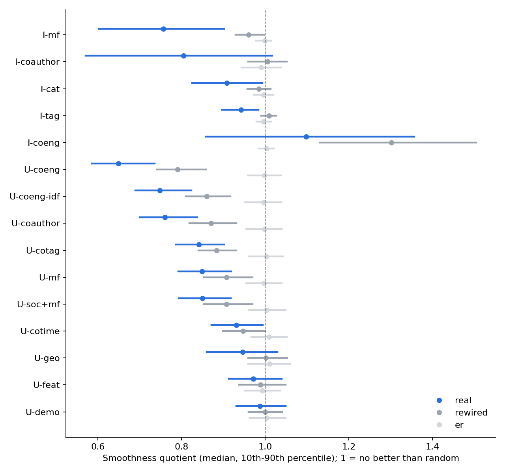
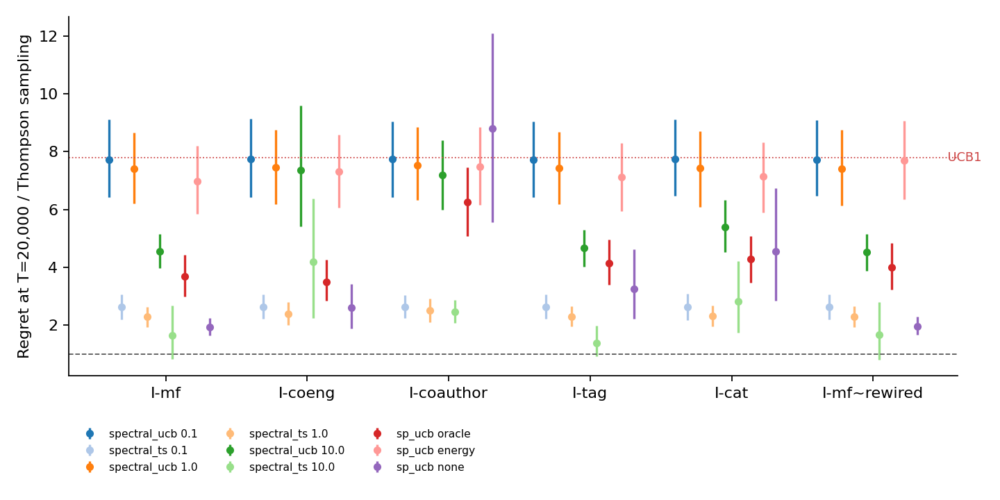

# KuaiRec Graph Alignment: Preliminary Report

9 October 2026. Phase 1 (alignment of 16 graphs) and a first run of Setting A (single-user item-graph bandits) from the [KuaiRec experiment plan](../../www/kuairec_experiment_plan.md). Reward model R1 (capped watch ratio / 5) and k = 10 unless stated.

## Findings

1. **Co-engagement is the best user–user graph, and collaborative graphs are the only ones that carry personal taste.**
    - Two users are linked if they fully watched the same videos (U-coeng). Its median smoothness quotient is 0.649, against 0.791 for its degree-preserving rewiring; 1 means no better than random.
    - With each user's activity and each video's popularity removed, U-coeng neighbours agree on taste at 0.020. That is ahead of matrix factorization (U-mf, 0.016) and co-engagement by author (0.018).
    - On the item side, factorization (I-mf, 0.046) and co-engagement (I-coeng, 0.034) carry personal taste. Tags, categories and same-author links (≤ 0.010) mostly group videos of similar popularity.
    - Profile, location, demographic and time-of-day user graphs are close to their nulls.
    - The ranking is stable across k = 5, 10 and 20.
2. **KuaiRec's social graph is too sparse to use.** Only 47 edges join evaluation users, and just 80 of the 1,411 users have a friend. Per edge, friends agree on taste the most of any graph (0.035), so the social result has to come from Last.fm.
3. **In the bandit runs, gains come from shrinkage, not from graph structure.**
    - On 300-video instances, a rewired I-mf graph gives the same regret as the real one. SpectralUCB at λ = 10 regrets 0.695× UCB1 on the rewiring and 0.697× on the real graph. Spectral TS at λ = 10 regrets 0.610× graph-free Gaussian TS on both.
    - Certified pooling gains slightly from structure: oracle-certified SP-UCB regrets 0.53× UCB1 on the real I-mf and 0.58× on its rewiring.
4. **Uncertified pooling fails badly for some users; certified pooling does not.** This is the misalignment failure from the theory, now seen on real data. The table gives ratios to Bernoulli Thompson sampling over 60 users, T = 20,000:

    | Policy | Graph | Median | 90th percentile | Share of users beating TS |
    | --- | --- | ---: | ---: | ---: |
    | Spectral TS, λ = 10 | I-mf | 0.68 | 1.71 | 0.75 |
    | Spectral TS, λ = 10 | I-coeng | 1.11 | 18.78 | 0.45 |
    | SP-UCB, no certificate | I-coauthor | 2.06 | 29.61 | 0.27 |
    | SP-UCB, no certificate | I-cat | 1.72 | 11.37 | 0.32 |
    | SP-UCB, oracle certificate | I-mf | 2.23 | 8.06 | 0.00 |
    | UCB1 (reference) | none | 4.29 | 14.02 | 0.00 |

    Smoothing hard (λ = 10), or pooling without a certificate, helps the typical user a lot: Spectral TS beats Bernoulli TS for 75% of users on I-mf. But it produces a heavy tail of users with near-linear regret. Oracle-certified SP-UCB never exceeds UCB1's tail, and it halves UCB1's regret on I-mf (0.53×) and I-coeng (0.50×).
5. **The energy certificate is too loose on real graphs, as the theory predicts.**
    - On 300-video instances the median energy-to-gap ratio is about 5 for every graph, well above the threshold of about 1 where it helps.
    - With energy certificates, SP-UCB can reject only 18–33% of suboptimal components (68% on I-coauthor), against 55–83% with oracle certificates. Its regret is 0.92–0.97× UCB1.
    - Closing the gap between the oracle and energy certificates is the main open problem for the paper's method.
6. **Smoother than chance does not mean safe to smooth (Phase 1).**
    - Smoothing users' true means with (I + λL)⁻¹ and picking the best video costs more on most real item graphs than on their rewired nulls. At λ = 10 the cost is 0.117 against 0.019 for I-mf, as a share of each user's best-to-average gap.
    - The exception is I-coauthor (0.040 against 0.184), whose same-author cliques keep rankings.

## Phase 1: alignment of 16 graphs



| Graph | Side | Edges | Quotient (real / rewired) | Personal-taste edge corr. (real / random) | Choice cost @λ=1 (real / rewired) | Choice cost @λ=10 (real / rewired) |
| --- | --- | ---: | --- | --- | --- | --- |
| I-mf | I2I | 25,492 | 0.756 / 0.961 | 0.046 / 0.002 | 0.014 / 0.007 | 0.117 / 0.019 |
| I-coauthor | I2I | 30,080 | 0.805 / 1.006 | 0.004 / 0.002 | 0.024 / 0.055 | 0.040 / 0.184 |
| I-cat | I2I | 29,558 | 0.908 / 0.985 | 0.010 / 0.002 | 0.036 / 0.020 | 0.099 / 0.079 |
| I-tag | I2I | 30,094 | 0.943 / 1.010 | 0.010 / 0.002 | 0.027 / 0.014 | 0.100 / 0.054 |
| I-coeng | I2I | 31,680 | 1.098 / 1.302 | 0.034 / 0.002 | 0.030 / 0.019 | 0.131 / 0.037 |
| U-coeng | U2U | 12,563 | 0.649 / 0.791 | 0.020 / 0.000 | 0.058 / 0.055 | 0.284 / 0.291 |
| U-coeng-idf | U2U | 11,193 | 0.748 / 0.860 | 0.018 / 0.001 | 0.057 / 0.052 | 0.294 / 0.296 |
| U-coauthor | U2U | 11,182 | 0.761 / 0.871 | 0.018 / 0.000 | 0.055 / 0.051 | 0.296 / 0.294 |
| U-soc | U2U | 47 | 0.787 / 0.862 | 0.035 / 0.001 | 0.010 / 0.014 | 0.014 / 0.016 |
| U-cotag | U2U | 10,716 | 0.842 / 0.884 | 0.004 / 0.001 | 0.054 / 0.046 | 0.299 / 0.297 |
| U-mf | U2U | 10,971 | 0.850 / 0.907 | 0.016 / 0.001 | 0.050 / 0.048 | 0.300 / 0.298 |
| U-soc+mf | U2U | 11,003 | 0.850 / 0.908 | 0.016 / 0.000 | 0.050 / 0.048 | 0.301 / 0.303 |
| U-cotime | U2U | 11,298 | 0.931 / 0.947 | 0.003 / 0.000 | 0.045 / 0.040 | 0.315 / 0.304 |
| U-geo | U2U | 10,263 | 0.946 / 1.002 | 0.007 / 0.000 | 0.059 / 0.040 | 0.350 / 0.301 |
| U-feat | U2U | 10,789 | 0.972 / 0.989 | 0.006 / 0.001 | 0.050 / 0.041 | 0.305 / 0.303 |
| U-demo | U2U | 10,934 | 0.988 / 1.000 | 0.002 / 0.000 | 0.046 / 0.042 | 0.328 / 0.304 |

How to read it:

- **Compare each graph with its own rewired null.** A raw quotient is not comparable across graphs with very different degree distributions. I-coeng scores 1.098, but its rewiring scores 1.302.
- **U-soc's quotient is not comparable either.** 94% of its nodes are isolated, and it is left out of the figure.
- **Neighbour-count sensitivity** is in [alignment_table_R1_k10.md](results/alignment_table_R1_k10.md). Rankings hold for k = 5 and 20.

### Graph definitions

All graphs are leakage-free: user-side signals use only interactions with non-evaluation videos, and video-side signals use only non-evaluation users.

| Graph | Built from |
| --- | --- |
| U-coeng | Jaccard on sets of fully watched videos (watch ratio ≥ 1) |
| U-coeng-idf | Cosine on engagement weighted down for popular videos |
| U-coauthor | Cosine on engagement aggregated by video author, weighted down for popular authors |
| U-mf / I-mf | PureSVD factors (rank 64) |
| U-cotag | Cosine on per-tag taste (tag mean minus the user's mean) |
| U-cotime | Cosine on hour-of-day activity profiles |
| U-soc | `social_network.csv` friend lists |
| U-feat / U-geo / U-demo | Profile fields; same city (1) or province (0.3); gender, age, phone brand, price band |
| I-coeng | Cosine on engagement from non-evaluation users, weighted down for heavy users |
| I-coauthor | Same author |
| I-tag / I-cat | Jaccard on tags; three-level category tree |

## Setting A: single-user bandits on item graphs

The protocol:

- 60 test users. For each user, 300 random videos and a horizon of T = 20,000, about 67 pulls per arm.
- Each graph is rebuilt on the user's 300 videos.
- Rewards are Bernoulli, with common random numbers across policies.
- Policies:
    - UCB1 and Bernoulli TS
    - SpectralUCB and Spectral TS at λ ∈ {0.1, 1, 10}
    - SP-UCB on a 20-component spectral partition, with oracle, energy and no certificates

The full table, with means, 95% bootstrap CIs, medians, 90th percentiles and ratios to each method's own family baseline, is in [setting_a_table.md](results/setting_a_table.md).



Per-instance diagnostics on the 300-video graphs:

| Graph | Quotient | Energy-to-gap (10th best) | Components rejectable, oracle certificate | Rejectable, energy certificate |
| --- | ---: | ---: | ---: | ---: |
| I-coauthor | 0.709 | 5.0 | 0.83 | 0.68 |
| I-mf | 0.846 | 4.9 | 0.61 | 0.21 |
| I-cat | 0.950 | 5.0 | 0.66 | 0.33 |
| I-mf~rewired | 0.964 | 5.3 | 0.55 | 0.03 |
| I-tag | 0.974 | 5.4 | 0.65 | 0.29 |
| I-coeng | 1.038 | 5.7 | 0.71 | 0.18 |

### Sensitivity to the reward definition (R3)

R3 counts a watch ratio above 2 as a like (mean 1) and everything else as 0.1. Under R3:

- **User-graph rankings are unchanged.** U-coeng is still the smoothest user graph (quotient 0.643 against 0.649 under R1). U-coeng-idf, U-coauthor and U-mf keep their order.
- **Item graphs look less smooth.** I-mf moves from 0.756 to 0.885; I-tag and I-coauthor move to about 1.0. Likes are sparse, so a video's like pattern is noisier than its watch time.
- **Personal-taste correlations rise everywhere**, for example U-coeng from 0.020 to 0.067, because liking is more personal than watch time. The order across graphs is similar.
- **Overall agreement:** the rank correlation of quotients between R1 and R3 is 0.80 across the 16 graphs. Full results are in [alignment_summary_R3_k10.csv](results/alignment_summary_R3_k10.csv).

## Setting B: pooling across users with user graphs

The protocol:
- 8 instances, each with 300 test users and 100 videos. Users arrive uniformly at random over T = 100,000 rounds: about 333 rounds per user, or 3.3 per user–video pair. This is the cold-user regime.
- Rewards are Bernoulli with R1 means.
- The full table is in [setting_b_table.md](results/setting_b_table.md).

| Policy | Graph | Regret ratio to per-user TS (mean over instances) |
| --- | --- | ---: |
| Gaussian TS pooled over users, λ = 10 | Complete graph (shrink toward the population) | 0.726 |
| Same | U-mf | 0.741 |
| Same | U-coeng rewired | 0.745 |
| Same | U-coauthor | 0.746 |
| Same | U-coeng | 0.759 |
| Same | U-geo | 0.893 |
| Global TS (one posterior per video for all users) | none | 0.929 |
| SP-KLUCB over user clusters, oracle certificate | U-coauthor / U-mf / U-coeng | 0.934–0.938 |
| SP-KLUCB, calibrated certificate (90th or 50th percentile) | any | 0.97–0.98 |
| SP-KLUCB, no certificate | any | 1.37–1.39 |

**Reading.** As on the item side, shrinkage drives the gain, not the graph's structure:

- Shrinking each video's estimate toward the population mean (the complete graph) beats every real user graph, and the rewired co-engagement graph matches the real one.
- Location helps least.
- Pooling over user clusters without a certificate is 39% worse than not pooling. With an oracle certificate it is about 6% better. Calibrated certificates are too wide to help at this horizon.

## Caveats

- **UCB-style methods are handicapped.** They use the Bernoulli-valid noise bound σ = 0.5 while true means average about 0.18, so they explore far more than Thompson sampling. Compare them within families. A KL-UCB baseline and a variance-adaptive SP-UCB are the fair next step.
- **Noisy ground truth.** Each true mean is one observed watch ratio, so measured alignment understates true preference alignment.
- **One video subset per user, 60 users.** Confidence intervals are wide for the heavy-tailed policies.
- **Approximations.** Spectral TS samples each arm's marginal posterior, not the joint posterior. Its prior mean, 0.18, is the platform average.
- **SP-UCB's partition** is spectral clustering into 20 components. Changing it changes component gaps.
- **Departures from the plan.** PureSVD instead of ALS and LightGCN; union kNN; caption-text and aggregate-statistics graphs not built yet; Settings B and C not run yet.

## Next steps

1. **Add a graph-free shrinkage baseline**, shrinking toward the user's running mean, to confirm that Spectral TS's gain is shrinkage. Add KL-UCB.
2. **Tighten certificates.** Estimate the energy bound on the partition from warm-up data, and test a data-driven certificate between the oracle and energy bounds.
3. **Run Setting B** (user graphs, cold users) with U-coeng, U-mf and U-coauthor against nulls. Phase 1 predicts small gains beyond shrinkage toward the population.
4. **Check sensitivity** to R2, and to more video subsets per user.

## Reproduce

From the repo root, with the virtual environment from [experiments/kuairec/requirements.txt](../../experiments/kuairec/requirements.txt):

```sh
.venv/bin/python -I experiments/kuairec/data.py                     # about 10 s
.venv/bin/python -I experiments/kuairec/graphs.py --k 5 10 20       # about 1 min
.venv/bin/python -I experiments/kuairec/alignment.py --k 10         # about 8 min on an idle 8-core laptop
.venv/bin/python -I experiments/kuairec/alignment.py --k 5 --quick
.venv/bin/python -I experiments/kuairec/alignment.py --k 20 --quick
.venv/bin/python -I experiments/kuairec/render_alignment.py --k 10
.venv/bin/python -I experiments/kuairec/setting_a.py --users 60 --horizon 20000 --jobs 6   # about 1 h
.venv/bin/python -I experiments/kuairec/analyze_a.py
```

Raw data goes in `data/kuairec_raw/` (git-ignored), from [Zenodo record 18164998](https://zenodo.org/records/18164998).
