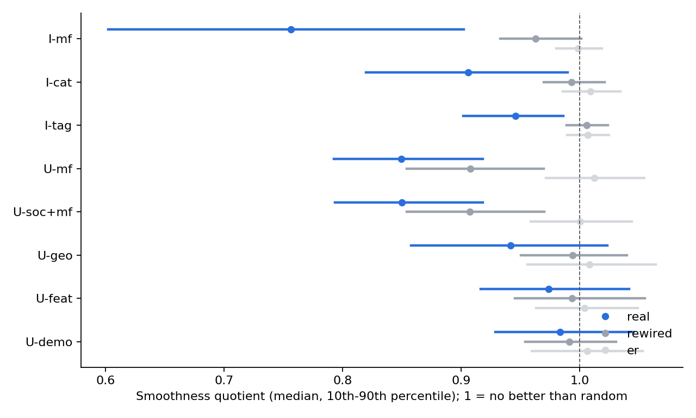

# KuaiRec Graph Alignment: Preliminary Report

9 October 2026. Phase 1 of the [KuaiRec experiment plan](../../www/kuairec_experiment_plan.md): no bandit runs yet. Reward model R1 (capped watch ratio / 5) unless stated.

## Findings

1. **Collaborative graphs are the only ones that carry personal taste.**
    - The item graph from matrix factorization (I-mf) is the smoothest graph. Its median smoothness quotient is 0.756, against 0.963 for its degree-preserving rewiring; 1.0 means no better than random.
    - With each user's activity level and each video's popularity removed, neighbouring videos in I-mf agree at a correlation of 0.046, against 0.002 for random pairs.
    - Tag and category graphs are only slightly smoother than chance, and almost all of that comes from popularity. Their personal-taste correlation is 0.010.
    - Among user graphs, factorization (U-mf, quotient 0.850) beats location (0.942), profile features (0.974) and demographics (0.984).
2. **KuaiRec's social graph is too sparse to use.** Only 146 of the 1,411 evaluation users appear in `social_network.csv`, with 47 edges among them, so 80 users (5.7%) have a friend. Per edge, friends agree on personal taste the most of any graph (0.035, against 0.001). The social-graph result has to come from Last.fm.
3. **Smoother than chance does not mean safe to smooth.** For each user, we smoothed the true means over the graph with (I + λL)⁻¹ and took the best video under the smoothed values. Then we measured what that choice costs against the user's true best, as a share of the gap between the user's best and average videos:

    | Graph | λ = 0.1 (real / rewired) | λ = 1 | λ = 10 |
    | --- | --- | --- | --- |
    | I-mf | 0.000 / 0.000 | 0.014 / 0.007 | 0.117 / 0.021 |
    | I-tag | 0.001 / 0.000 | 0.030 / 0.014 | 0.099 / 0.051 |
    | I-cat | 0.003 / 0.001 | 0.039 / 0.017 | 0.100 / 0.082 |
    | U-mf | 0.000 / 0.000 | 0.050 / 0.048 | 0.300 / 0.299 |
    | U-geo | 0.000 / 0.000 | 0.056 / 0.040 | 0.350 / 0.303 |

    - **Real graphs cost more than random ones.** On every item graph, real graphs cost more than their rewired nulls, up to 5.6 times more for I-mf at λ = 10. Smoothing on a random graph acts like uniform shrinkage toward the mean, which keeps rankings. A real graph pulls each video toward its neighbourhood's level, which reorders the top.
    - **This is the repo's misalignment mechanism, now measured on real data.** A spectral bandit with a fixed, large λ inherits this cost as a regret floor that grows linearly with time.
    - **Small λ is nearly free.** At λ = 0.1 the cost is close to zero on every graph.
4. **User graphs barely change the best choice beyond shrinkage toward the population.**
    - Real and rewired user graphs cost almost the same at every λ.
    - Users' rows correlate at 0.38 even for random pairs, so a shared popularity component dominates. Pooling across users mostly imports that component.
    - This predicts that GOB.Lin-style user pooling helps mainly in the first rounds of each user's history.

## What was run

| Step | Result |
| --- | --- |
| Data checks | Evaluation users and videos are subsets of the big matrix, and the two matrices share **no** (user, video) pairs, so the graphs are leakage-free by construction. Of the 3327 × 1411 pairs, 17,827 are blocked (0.4%). Watch ratio: median 0.77; 4.6% of pairs above 2; 0.5% above 5. ([step0_report.json](results/step0_report.json)) |
| Graphs | 7 user graphs and 3 item graphs, each with a degree-preserving rewiring and an Erdős–Rényi null. k = 10, union kNN, Laplacian scaled to mean degree 1. ([graphs_meta.json](results/graphs_meta.json)) |
| Diagnostics | Smoothness quotient, edge correlation (raw and with popularity and activity removed), top-1 and top-10 preservation, and choice cost after smoothing at λ ∈ {0.1, 1, 10}. ([alignment_summary_R1.csv](results/alignment_summary_R1.csv)) |



Summary table ([alignment_table_R1.md](results/alignment_table_R1.md)):

| Graph | Side | Edges | Isolated | Quotient (real / rewired) | Edge corr. (real / random pairs) | Top-1 kept @λ=1 (real / rewired) | Choice regret @λ=1 (real / rewired) |
| --- | --- | ---: | ---: | --- | --- | --- | --- |
| I-mf | I2I | 25,492 | 0 | 0.756 / 0.963 | 0.101 / 0.074 | 0.272 / 0.291 | 0.014 / 0.007 |
| I-cat | I2I | 29,529 | 0 | 0.906 / 0.993 | 0.077 / 0.074 | 0.218 / 0.263 | 0.039 / 0.017 |
| I-tag | I2I | 30,052 | 0 | 0.946 / 1.006 | 0.077 / 0.074 | 0.259 / 0.294 | 0.030 / 0.014 |
| U-soc | U2U | 47 | 1,331 | 0.787 / 0.858 | 0.398 / 0.384 | 0.950 / 0.947 | 0.010 / 0.016 |
| U-mf | U2U | 10,971 | 0 | 0.850 / 0.908 | 0.418 / 0.383 | 0.230 / 0.237 | 0.050 / 0.048 |
| U-soc+mf | U2U | 11,003 | 0 | 0.850 / 0.907 | 0.418 / 0.384 | 0.231 / 0.225 | 0.050 / 0.047 |
| U-geo | U2U | 10,264 | 0 | 0.942 / 0.994 | 0.389 / 0.384 | 0.226 / 0.242 | 0.056 / 0.040 |
| U-feat | U2U | 10,764 | 0 | 0.974 / 0.994 | 0.391 / 0.384 | 0.236 / 0.243 | 0.047 / 0.043 |
| U-demo | U2U | 10,953 | 0 | 0.984 / 0.991 | 0.386 / 0.384 | 0.229 / 0.242 | 0.045 / 0.040 |

U-soc's quotient is not comparable with the others: 94% of its nodes are isolated, and scaling 47 edges to mean degree 1 inflates their weights. It is left out of the figure.

## Caveats

- **Noisy ground truth.** Each true mean is a single observed watch ratio. That observation noise makes every signal look rougher, so these quotients understate how aligned the underlying preferences are. A split-half check is impossible with one observation per pair. Reward model R2 or a denoised mean is the next sensitivity check.
- **Departures from the plan.**
    - Embeddings are PureSVD (rank 64) instead of ALS and LightGCN.
    - Graphs are union kNN instead of mutual kNN plus nearest neighbour.
    - Only k = 10 was run.
    - The caption-text and aggregate-statistics item graphs are not built yet.
- **Not yet computed:** the energy-to-gap ratio on 300-video bandit instances, and the resistance radius. Both need graphs rebuilt on each sampled subset.
- **Degree structure alone matters.** The rewired U-mf graph is itself smoother than chance (0.908), so a share of U-mf's alignment comes from which users are hubs, not from who connects to whom.

## Implications for the bandit experiments

- **Main graphs:** I-mf and U-mf. The tag and category graphs are the "popularity-only" condition, and rewired graphs are the null.
- **Prediction for Setting A:** SpectralUCB/TS with λ ≥ 1 on I-tag or I-cat plateaus above per-user Thompson sampling, while certified pooling (SP-UCB, GDE-UCB) does not. With λ = 0.1 the bias is negligible, so the comparison should report the whole λ grid.
- **The social-graph condition moves to Last.fm.**

## Reproduce

From the repo root, with the virtual environment set up as in [experiments/kuairec](../../experiments/kuairec):

```sh
.venv/bin/python -I experiments/kuairec/data.py         # about 10 s
.venv/bin/python -I experiments/kuairec/graphs.py       # about 25 s
.venv/bin/python -I experiments/kuairec/alignment.py    # about 5 min on 8 cores
.venv/bin/python -I experiments/kuairec/render_alignment.py
```

Raw data goes in `data/kuairec_raw/` (git-ignored), from [Zenodo record 18164998](https://zenodo.org/records/18164998).
